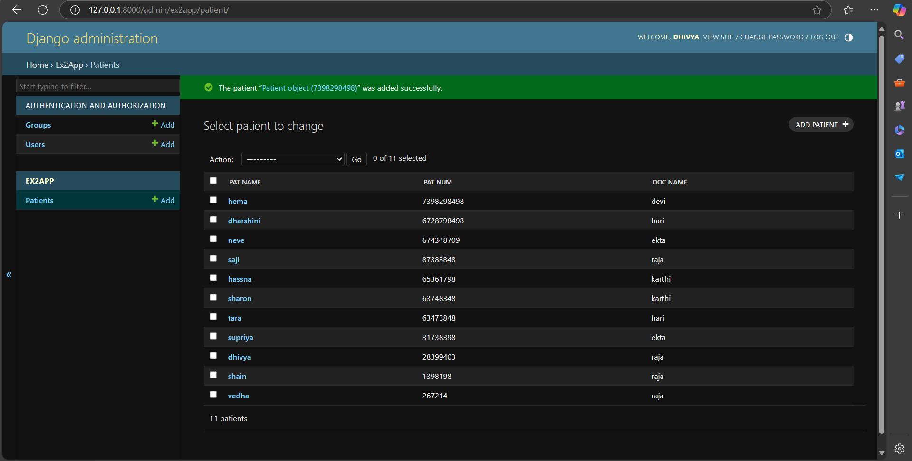

# Ex02 Django ORM Web Application
## Date: 

## AIM
To develop a Django application to store and retrieve data from a Movies Database using Object Relational Mapping(ORM).


## DESIGN STEPS

### STEP 1:
Clone the problem from GitHub

### STEP 2:
Create a new app in Django project

### STEP 3:
Enter the code for admin.py and models.py

### STEP 4:
Execute Django admin and create details for 10 books

## PROGRAM
```
models.py
from django.db import models
from django.contrib import admin
class Patient(models.Model):
    pat_id=models.IntegerField(primary_key=True)
    pat_name=models.CharField(max_length=30)
    pat_num=models.IntegerField(primary_key=True)
    doc_name=models.CharField(max_length=30)

class PatientAdmin(admin.ModelAdmin):
    list_display=('pat_id','pat_name','pat_num','doc_name')
admin.py

from django.contrib import admin
from.models import Patient,PatientAdmin
admin.site.register(Patient,PatientAdmin)
```
## OUTPUT


## RESULT
Thus the program for creating movies database using ORM hass been executed successfully
